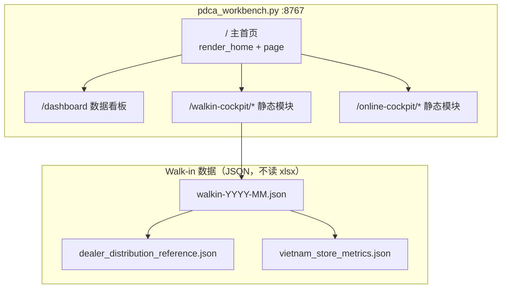

# 数据岗位 PDCA 工作台 · 前端与路径总览

> 供 GPT / 人工改 UI 用。仓库根目录：`D:\经销商PDCA`  
> 工作台工作区：`D:\经销商PDCA\data_platform\data_role_pdca_mvp`

---

## 1. 访问地址与端口

| 页面 | URL | 说明 |
|------|-----|------|
| **主首页** | http://127.0.0.1:8767/ | 数据岗位 PDCA 工作台（推荐端口） |
| 数据看板 | http://127.0.0.1:8767/dashboard?date=YYYY-MM-DD | 按日生成的 `dashboard.html` |
| 海外客流（Walk-in） | http://127.0.0.1:8767/walkin-cockpit/ | 经销商海外客流分析台（含线上经营块） |
| 线上经营 | http://127.0.0.1:8767/walkin-cockpit/#oi-merged | 已并入客流分析（旧 `/online-cockpit/` 自动跳转） |
| 统一皮肤 CSS | `/workbench-cockpit-shell.css` | 子驾驶舱与主页一致浅色皮肤 |

### 端口注意

- 工作台默认读环境变量 `PDCA_WORKBENCH_PORT`，**未设置时默认 8765**。
- 本机 **8765** 常被其他程序占用（如 *Sales Automation Dashboard*），该程序**没有** `/walkin-cockpit/`，会返回 **404**。
- 日常使用请固定 **8767** 启动 PDCA 工作台。

### 启动命令（PowerShell）

```powershell
$env:PDCA_WORKBENCH_PORT = '8767'
python D:\经销商PDCA\data_platform\data_role_pdca_mvp\scripts\pdca_workbench.py
```

改完 `pdca_workbench.py` 或静态 HTML/CSS 后，需**结束旧进程并重新执行**上述命令，浏览器**强制刷新**（Ctrl+F5）。

### 数据同步（VPS → Excel → mock）

```powershell
# 可选：跳过 vertu 拉数（未 login 时）
python D:\经销商PDCA\data_platform\data_role_pdca_mvp\scripts\sync_workbench_data.py --date 2026-06-05
# 含 VPS：先 vertu login，再去掉 --skip-vps
```

桌面 Excel（仅一次性导入，日常读 JSON）：

- `c:\Users\frank\Desktop\越南门店数据.xlsx` → `vietnam_store_metrics.json`
- `c:\Users\frank\Desktop\Data collecet(5).xlsx` → `vn_data_collect_reference.json`

实时接口：`GET /api/walkin?month=YYYY-MM&date=YYYY-MM-DD`（由 `scripts/workbench_data.py` 组装）。

---

## 2. 架构一览



- **主首页**：无独立 `.html`，由 Python 函数拼 HTML 字符串后 `send_html` 输出。
- **Walk-in / 线上**：独立目录下的 `index.html` + CSS/JS + `data/*.json`，由 `serve_cockpit_module` 静态托管。

---

## 3. 主首页 `http://127.0.0.1:8767/` — 本地文件

### 3.1 当前首页（经营驾驶舱模板）

```
D:\经销商PDCA\data_platform\data_role_pdca_mvp\modules\home_dashboard\index.html
```

来源：`dashboard_template_with_api_hooks.html`，通过 `/api/dashboard/*` 等接口拉数。  
后端 API 实现在 `scripts\pdca_workbench.py`（`api_dashboard_overview`、`dispatch_home_dashboard_api` 等）。

经典四卡首页（Hermes 表单、Agent 卡片）保留在：

```
GET http://127.0.0.1:8767/home-classic
```

### 3.2 经典首页（可选）

```
D:\经销商PDCA\data_platform\data_role_pdca_mvp\scripts\pdca_workbench.py
```

| 作用 | 函数名 | 约行号 | 改什么 |
|------|--------|--------|--------|
| 全站 HTML 外壳 + **全局 CSS** | `page()` | 1858 起 | 配色、字体、圆角、阴影 |
| **经典首页结构** | `render_home()` | 约 2580 起 | 四卡 + 待办 + Hermes |
| 路由：`GET /home-classic` | `WorkbenchHandler._do_GET` | 搜索 `home-classic` | 一般不常改 |
| KPI 卡片 HTML 模板 | `metric_card()` | 1650 | 单卡样式与链接 |
| 客户管理 iframe 入口卡 | `customer_mgmt_card()` | 1744 | 文案与跳转 |
| 数据看板入口卡 | `dashboard_card()` | 1768 | 文案与图标 |
| 海外客流入口卡 | `walkin_cockpit_card()` | 1790 | 文案、链接 `/walkin-cockpit/` |
| 线上经营入口卡 | `online_cockpit_card()` | 1810 | 文案、链接 `/online-cockpit/` |
| Hermes 任务输入区 | `render_hermes_panel()` | 2046 | 任务表单 UI |
| Hermes 结果弹层 | `render_hermes_result_modal()` | 2148 | 弹窗 |
| Agent 三卡片区 | `render_agent_cards()` | 2205 | Agent 头像与按钮 |
| 产出物（Excel/报告/PDCA） | `render_output_panel()` | 2332 | 底部产出链接区 |
| VPS 首页摘要（IM/待办） | `fetch_home_vps_summary()` | 2432 | 逻辑，少改 UI |

### 3.3 经典首页模块顺序（`render_home` 内）

1. 第一行 `.grid`：`dashboard_card` + `customer_mgmt_card` + IM 未读 + 今日待办  
2. 第二行 `.grid-secondary`：`walkin_cockpit_card` + `online_cockpit_card`  
3. `section`：今日待办（VPS）表格  
4. `render_hermes_panel`  
5. `render_agent_cards`  
6. `render_output_panel`  
7. `render_hermes_result_modal`（有结果时）

### 3.3 给 GPT 改首页的提示语（可复制）

```text
请只修改文件：
D:\经销商PDCA\data_platform\data_role_pdca_mvp\scripts\pdca_workbench.py

目标页面：http://127.0.0.1:8767/ 主首页
- 全局样式：函数 page() 内 <style>（约 1858 行起）
- 首页结构：函数 render_home()（约 2452 行起）
- 入口卡片：dashboard_card / walkin_cockpit_card / online_cockpit_card（约 1768–1830 行）

不要新建独立 home.html，保持 Python 拼字符串方式。
改完说明需要重启 pdca_workbench.py 进程。
```

---

## 4. 子页面本地路径

### 4.1 数据看板（按日生成，非手写首页）

| 类型 | 路径 |
|------|------|
| 生成脚本逻辑 | `D:\经销商PDCA\data_platform\data_role_pdca_mvp\scripts\` 下日跑脚本（见 `run_data_role_pdca_daily.ps1`） |
| 当日输出目录 | `D:\经销商PDCA\data_platform\data_role_pdca_mvp\outputs\YYYY-MM-DD\` |
| 看板 HTML | `...\outputs\YYYY-MM-DD\dashboard.html` |
| 数据汇总报告 | `...\outputs\YYYY-MM-DD\data_summary_report.md` |
| Excel | `...\outputs\YYYY-MM-DD\YYYY-MM-DD_data_summary.xlsx` |

工作台通过 `/dashboard?date=YYYY-MM-DD` 读取对应日的 `dashboard.html`。

### 4.2 海外客流 Walk-in（独立前端）

| 文件 | 绝对路径 |
|------|----------|
| 主页面 | `D:\经销商PDCA\data_platform\data_role_pdca_mvp\modules\walkin_cockpit\index.html` |
| 换肤 CSS | `D:\经销商PDCA\data_platform\data_role_pdca_mvp\modules\walkin_cockpit\vertu-reskin.css` |
| 浏览器脚本 | `D:\经销商PDCA\data_platform\data_role_pdca_mvp\modules\walkin_cockpit\scripts\`（含 `walkin-guojin-browser.js` 等） |
| 月度数据包 | `D:\经销商PDCA\data_platform\data_role_pdca_mvp\modules\walkin_cockpit\data\walkin-YYYY-MM.json` |
| 代理商终销参考 | `D:\经销商PDCA\data_platform\data_role_pdca_mvp\modules\walkin_cockpit\data\dealer_distribution_reference.json` |
| 越南 Walk-in 参考 | `D:\经销商PDCA\data_platform\data_role_pdca_mvp\modules\walkin_cockpit\data\vietnam_store_metrics.json` |

**路由挂载**（仍在 `pdca_workbench.py`）：

- 目录常量：`WALKIN_COCKPIT_DIR`（约第 33 行）
- 静态解析：`resolve_walkin_asset()`（约 55 行）
- 服务：`serve_walkin_cockpit()` / `serve_cockpit_module()`（约 2712–2736 行）

页面默认请求：`data/walkin-{selectedMonth}.json`（如 `walkin-2026-05.json`）。  
已移除国内门店 demo 兜底（北京 skp 等），加载失败时列表为空。

### 4.3 线上经营

| 文件 | 绝对路径 |
|------|----------|
| 主页面 | `D:\经销商PDCA\data_platform\data_role_pdca_mvp\modules\online_cockpit\index.html` |

路由：`/online-cockpit/`，逻辑同 Walk-in 静态托管。

### 4.4 客户管理（外嵌，非本仓库主文件）

- 默认端口：**8787**（`CUSTOMER_MGMT_PORT`）
- 根目录在 `pdca_workbench.py` 内 `CUSTOMER_MGMT_ROOT`（约 31 行），为另一项目路径。
- 首页通过 `customer_mgmt_card()` + iframe 页 `/customer-mgmt` 引用。

---

## 5. Walk-in 数据流（经销商替换门店）

驾驶舱**运行时不再读取 Excel**，只读 JSON。

```text
用户 Excel（一次性）
  c:\Users\frank\Downloads\代理商终销Distribution Sell out.xlsx
        ↓
  scripts/import_dealer_distribution_once.py
        ↓
  modules/walkin_cockpit/data/dealer_distribution_reference.json  （当前约 33 家代理商）
        ↓
  scripts/build_walkin_bundle.py
        ↓
  modules/walkin_cockpit/data/walkin-2026-05.json
  modules/walkin_cockpit/data/walkin-2026-06.json
        ↓
  index.html  fetch('data/walkin-YYYY-MM.json')
```

### 更新 Excel 后重跑

```powershell
python D:\经销商PDCA\data_platform\data_role_pdca_mvp\scripts\import_dealer_distribution_once.py
python D:\经销商PDCA\data_platform\data_role_pdca_mvp\scripts\build_walkin_bundle.py --month 2026-05
python D:\经销商PDCA\data_platform\data_role_pdca_mvp\scripts\build_walkin_bundle.py --month 2026-06
```

说明：表中 Sell out 金额为 0 时，进店/留资等由客户类型 A/B/S 推算；有真实终销后重跑即可刷新。

### 越南区

- 真实参考：`vietnam_store_metrics.json`（胡志明 Walk-in 旗舰店）
- 与代理商合并进 `walkin-2026-05.json`（1 家越南店 + 代理商列表）

---

## 6. 工作台其它常用路径

| 用途 | 路径 |
|------|------|
| 工作区根 | `D:\经销商PDCA\data_platform\data_role_pdca_mvp\` |
| 日问卷模板 | `...\templates\daily_questionnaire.md` |
| 问卷录入 | `...\inputs\questionnaires\` |
| 待办 CSV | `...\inputs\todos\` |
| 日输出 | `...\outputs\YYYY-MM-DD\` |
| IM 待发 | `...\outbox\` |
| Agent 规则（仓库级） | `D:\经销商PDCA\AGENTS.md` |
| 小组 PDCA（杨晶晶） | `D:\经销商PDCA\teams\yang-jingjing\` |
| 本说明文档 | `D:\经销商PDCA\data_platform\data_role_pdca_mvp\docs\WORKBENCH_FRONTEND_GUIDE.md` |

---

## 7. 相关文档

| 文档 | 路径 |
|------|------|
| 用户指南 | `docs/USER_GUIDE.md` |
| 项目设计 | `docs/PROJECT_DESIGN_AND_FEATURES.md` |
| Hermes 入口 | `docs/HERMES_ENTRY.md` |

---

## 8. 故障排查

| 现象 | 原因 | 处理 |
|------|------|------|
| 8767 无法连接 | 进程未启动 | 执行第 1 节启动命令 |
| 8765 能开首页但 Walk-in 404 | 8765 不是 PDCA 工作台 | 改用 **8767** |
| 改 HTML/CSS 不生效 | 浏览器缓存或未重启服务 | Ctrl+F5；重启 `pdca_workbench.py` |
| Walk-in 空白 / 无代理商 | JSON 未生成或月份无文件 | 运行 `build_walkin_bundle.py`，页面选对应月份 |

---

## 9. 改 UI 分工建议

| 想改的内容 | 改哪里 |
|------------|--------|
| 主首页配色、布局、四卡、待办表、Agent 区 | `pdca_workbench.py` → `page()` + `render_home()` + 各 `*_card()` |
| 海外客流整页、图表、代理商文案 | `modules/walkin_cockpit/index.html` + `vertu-reskin.css` |
| 线上经营整页 | `modules/online_cockpit/index.html` |
| 某日数据看板图表 | 重新生成 `outputs/YYYY-MM-DD/dashboard.html`（改生成脚本，非 walkin） |
| 代理商名单与指标 | Excel 导入脚本 + `build_walkin_bundle.py` + JSON |

---

*文档版本：2026-06-04 · 端口示例 8767*
